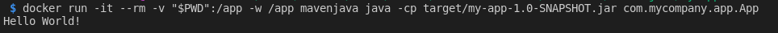

# Writing a Dockerfile for a Maven-based Java application

Source: https://runnable.com/docker/java/dockerize-your-java-application


We will be using an Oracle JDK-8 image [we have built before](https://github.com/docker-oilgains/oracle-java-8/blob/master/oses/phusion.Dockerfile). The image has already Oracle Java 8 installed. So, the `f0nzie/oracle-java-8:phusion` image will be our base image.

### 1. Create the Dockerfile

```
FROM f0nzie/oracle-java-8:phusion

ENV MAVEN_VERSION 3.3.9

RUN mkdir -p /usr/share/maven \
  && curl -fsSL http://apache.osuosl.org/maven/maven-3/$MAVEN_VERSION/binaries/apache-maven-$MAVEN_VERSION-bin.tar.gz \
    | tar -xzC /usr/share/maven --strip-components=1 \
  && ln -s /usr/share/maven/bin/mvn /usr/bin/mvn

ENV MAVEN_HOME /usr/share/maven

VOLUME /root/.m2

CMD ["mvn"] 
```

In this Dockerfile we have used the command `VOLUME`. This command is used to expose to the host machine the volume from the  container. We can map this volume to any host directory.

### 2. Build the Docker image

Build the docker image from the above Dockerfile using this command:

```
docker build -f "Dockerfile" -t mavenjava "."
```

This will build an image with the name of `mavenjava` and tag of `latest`. Name and tag your images clearly so that you can easily identify each image.

### 3. Run a test application

Run a test Maven application using this image that we created.

If you don’t have a Maven project, create one using this command:

```
docker run -it --rm -v "$PWD":/app -w /app mavenjava mvn archetype:generate -DgroupId=com.mycompany.app -DartifactId=my-app -DarchetypeArtifactId=maven-archetype-quickstart -Dinte
```

This will create a Maven project in the current directory under the `my-app` directory.

### 4. Build the project and test the JAR file

Go to the project directory.

```
cd  my-app
```

Build the project.

```
docker run -it --rm -v "$PWD":/app -w /app mavenjava mvn package
```

Test the newly compiled and packaged JAR with the following command.

```
docker run -it --rm -v "$PWD":/app -w /app mavenjava java -cp target/my-app-1.0-SNAPSHOT.jar com.mycompany.app.App
```

This should print the following output:



